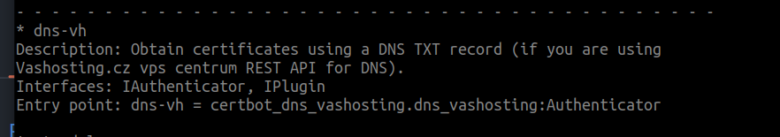

# Instalace

```bash
pip3 install https://github.com/Attanon/certbot-dns-vashosting/releases/download/0.0.3/certbot-dns-vashosting-0.0.3.tar.gz
```

Oveřit že je nainstalováno
```bash
certbot plugins
```


# Ukázkový konfig
```ini
certbot_dns_vashosting:dns_vh_endpoint="https://serverId.vas-server.cz/admin/api/v1/api.php"
certbot_dns_vashosting:dns_vh_admin="vhadmin@email.cz"
certbot_dns_vashosting:dns_vh_api_key="ApiKey"
```

# Příkaz ke spuštění
```bash
certbot certonly \
        --agree-tos --email your-email \
        --expand --renew-by-default \
		--certbot-dns-vashosting:dns-vh \
		--certbot-dns-vashosting:dns-vh-credentials ~/vas-hosting.ini \
        -d "*.vas-server.cz"
```
